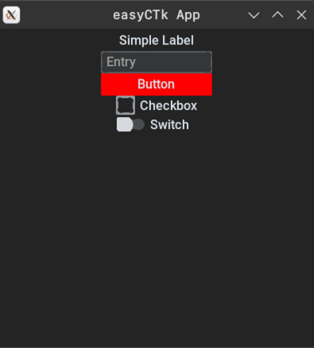

# easyCTk

**easyCTk** is a lightweight framework based on `CustomTkinter`, designed to make the creation of simple Python GUI apps significantly easier. The main goal of this framework is to let developers focus more on project logic and less on UI configuration.

## Key Features
- **Rapid Initialization** - easily initialize basic UI widgets like buttons, labels, and switches.
- **Clean Syntax** - very simple and easy to learn. Create windows, labels, and entries in just a few lines of code.



## Quick Start

```python
from easyCTk import App

# Initialize window
window = App()

# Create widgets
window.label(text="Simple Label")
window.entry(placeholder_text="Entry")
window.button(text="Button")
window.checkbox(text="Checkbox")
window.switch(text="Switch")

# Start the window!
window.run()
